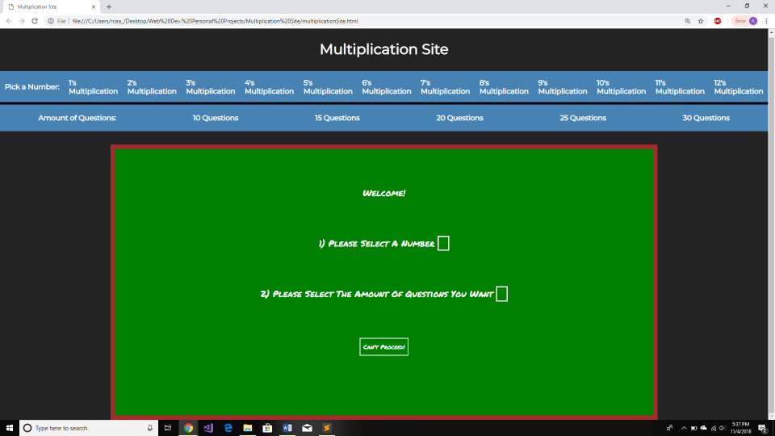
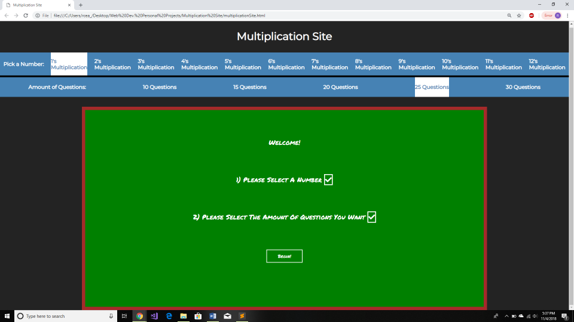
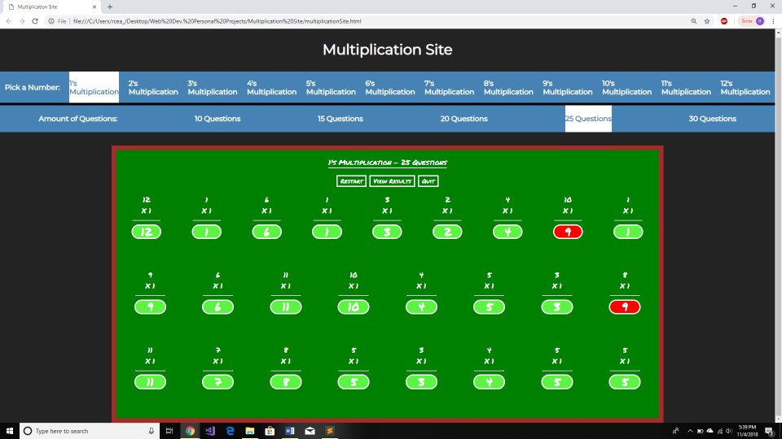
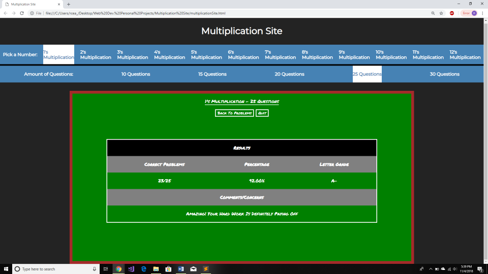

This is a multiplication site that allows users to practice multiplying numbers 1-12. When the user enters, they must choose which number they wish to multiply by and the amount of questions they want. They must fulfill these two criteria if they wish to start the game. When the user starts the set of problems, they will see a title, three buttons (restart, finish, and quit) and the problems themselves. Clicking the restart button will generate a new set of problems without changing the amount of problems or the number chosen. When the user clicks the finish button, a light-green color will indicate which problems they got right and a red color will indicate which problems they got wrong. When finished, a new button will pop up allowing the user to see a small table summary of their results. They can flip back and forth between this table screen and the original in-game screen. Lastly, when clicking the finish button, the user will go back to the original main menu they saw when they first went to the site.

This is what the user will see when they first go to the site.

The user needs to select a specific number's times table and the amount of questions they want.

When the user clicks the begin button this they will see something similar to this depending on what number/question amount they choose

The user will be able to see which questions they got right and which ones they got wrong.

If the user clicks the "View Results" button on the previous page, they will see a table with the following contents that pertain to their performance. (Results come from previous image)

